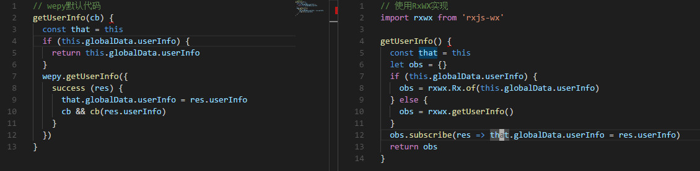
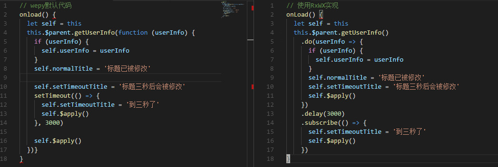

# RxWX

*Write less, do more elegantly!*

封装了[RxJS](http://cn.rx.js.org/manual/overview.html)对象[微信小程序API](https://mp.weixin.qq.com/debug/wxadoc/dev/api/)，让你写出更优雅更简介的代码。

RxWX模块支持所有微信小程序中wx对象的属性和函数，例如`getUserInfo`等。
RxWX模块的`Rx`属性为RxJS对象，支持RxJS对象所有属性，例如`Observable`等。

# 安装

1. 下载

使用github

`git clone https://github.com/yalishizhude/RxWX.git`

使用npm

`npm i rxjs-wx`

使用yarn

`yarn add rxjs-wx`

2. 拷贝根目录下的Rx.js和RxWX.js到项目目录

3. 引用文件

`import rxwx from 'RxWX.js'`

# 小程序中使用示例

[源码地址](https://github.com/yalishizhude/RxWX-example)

## 同步函数
```
// 原写法
try {
  let result = wx.removeStorageSync('xx')
  console.log(result) 
} catch(e) {
  console.error('小程序API发现错误')
}

// 使用RxWX，rxwx对象具有wx对象的所有函数和属性，函数返回Observable对象
import rxwx from '../../utils/RxWX.js'

rxwx.removeStorageSync('xx')
  .catch((e) => console.error('RxWX发现错误'))
  .subscribe((resp) => console.log(resp))
```

## 异步函数

```
// 原写法
wx.removeStorage({
  key: 'xx',
  success: function(res) {
    console.log(res)
  },
  error: function(e) {
    console.error('小程序API发现错误')
  }
})
// 引用RxWX，rxwx对象函数参数与wx同名函数一致
import rxwx from '../../utils/RxWX.js'

rxwx.removeStorage({key: 'xx'})
  .catch((e) => console.error('RxWX发现错误'))
  .subscribe((resp) => console.log(resp))
```

## 异步嵌套

```
// 调用小程序原生API
wx.login({
  success(res) {
    wx.getUserInfo({
      success(res) {
        console.log(res.userInfo)
      },
      fail(e) {
        console.error(e)
      }
    })
  },
  fail(e) {
    console.error(e)
  }
})

// 调用RxWX
import rxwx from '../../utils/RxWX.js'

rxwx.login()
  .switchMap(() => rxwx.getUserInfo())
  .catch(e => console.error(e))
  .subscribe(res => console.log(res.userInfo))
```

## 异步合并

```
// 调用小程序API
let getUser =  new Promise((success, fail) => {
  wx.getUserInfo({
    success,
    fail
  })
})
let getSystem =  new Promise((success, fail) => {
  wx.getSystemInfo({
    success,
    fail
  })
})
Promise.all([getUser, getSystem])
.then((resp) => console.log(resp), e => console.error(e))

// 调用RxWX中的Rx对象，包含RxJS所有操作符和函数
import rxwx, {Rx} from '../../utils/RxWX.js'
// 使用zip操作符
Rx.Observable.zip(rxwx.getUserInfo(), rxwx.getSystemInfo())
  .catch(e => console.error(e))
  .subscribe(resp => console.log(resp))
```
## 网络请求

### http请求
```
let handlerA = (res) => console.log('handler a:', res)
let handlerB = (res) => console.log('handler b:', res)
// 调用小程序API
let url = 'http://localhost:3456'
wx.request({
  url,
  success(res) {
    // 逻辑与请求的紧耦合
    handlerA(res)
    handlerB(res)
  }
})

// 调用RxWX
let req = rxwx.request({
  url
})
// 轻轻松松将业务逻辑与请求分离
req.subscribe(handlerA)
req.subscribe(handlerB)
```
### websocket

```
let url = 'ws://localhost:34567'
// 调用微信小程序API
let ws = wx.connectSocket({
  url
})
ws.onOpen(() => {
  ws.send({ data: new Date })
  ws.onMessage(msg => console.log(msg.data))
  ws.close()
  ws.onClose(msg => console.log('Websocket closed.'))
})
// 调用RxWX
rxwx.connectSocket({
  url
})
.subscribe(ws => {
  ws.onOpen(() => {
    ws.send({ data: new Date })
    ws.onMessage(msg => console.log(msg.data))
    ws.close()
    ws.onClose(msg => console.log('Websocket closed.'))
  })
})
```

# wepy中使用示例
[源码地址](https://github.com/yalishizhude/RxWX-wepy-example)

1. 安装RxWX

`npm i -S rxjs-wx`

当然我更推荐你使用yarn

`yarn add rxjs-wx`

2. 引入模块

`import rxwx from 'rxjs-wx'`

3. 使用rxwx

`src/app.wpy`



`src/pages/index.wpy`



# 更多

[RxJS](https://github.com/Reactive-Extensions/RxJS)

[微信小程序API](https://mp.weixin.qq.com/debug/wxadoc/dev/api)

更多内容请关注公众号“web学习社”。

